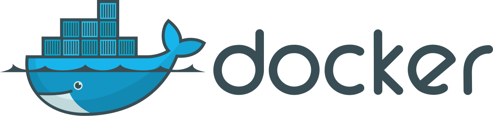
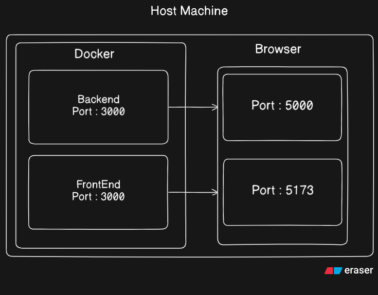

# Docker - Beginner's Guide 



## DockerWhat is docker: 

Docker is an application that creates an environment in our system in which we can configure dependencies so that if a large team is working on that project each one has the project setup rightly.
Basically, Docker is the solution of

`"It's works on my machine"`

### The Problem Statement:

Suppose you have joined a new development team that compormises of over 100 developers so in order to start working you have to setup the project locally in your system but it might be possible that the project requires and older version like it might be using node.js version 17 and your have node version 22 installed in your machine.

It is of high possibility that some packages require only node version 17 to run properly so you have to install that. But later you work on a personal project and it uses the latest node version so again you have to download and configure the latest version in your system. So it becomes a hastle every time to change the node version to run a project.

Here the docker comes into the picture. Docker says that you can create virtual environments and install the desired versoin of the packages and then run them separely. So now you can run a the company project in a envirionment that having node 17 installed and the other project configurations and your system can run node 22. 
Ok now you know what is docker and why it is used, Let's get started with using it

## Getting started with Docker:

First install the docker desktop in your system from docker official website 
Install the Docker Desktop from the above link open it 
Before getting our hand dirty with docker we need to understand a few docker concepts

- Images
- Containers

These are the two most important concetps in docker and some times they are confusing for beginners 
but lets break down these two and understand what are they

### Images:

A docker image is a blueprint for creating containers. It is like a class in OOPs paradigm. Like a class is used to create objects and it is a blueprints for the objects to be created similary image is a blueprint for containers. The dependencies of the software are defiend in the images. 
Or you can assume image as a recipie which include the indrigidents(dependencies) which are required to create a certain dish (setup a project).

### Containers: 


Containers are the instances of the image like an object is an instance of a class in OOPs paradiagm. It is a standalone pakcage of the software. A container is created when you run an image. It's like launching an app from an installer.

Now you have got an understanding of images and containers. Lets play around images and containers. 
Go to the webstie docker-hub and search for hello world

#### Docker Hub:

It is similar to github but it is used to manage images like downloading, publishing etc. 
Ok now open the terminal in the docker desktop and write the command

`docker pull hello-world`

This will first check is the image present locally if not it will download it from the docker hub.

It is a basic image for learning purpose to create a container from it you can execute this command

`docker run hello-world`

This will create a container for the image hello-world and assign a random name to it you can see it in the container tab in the Docker Desktop.

Now you don't have to create a new container each time to run the image. So for that we create the contaier first time and then start and stop the container when needed. 
Here's the commands for that

#### Start any container

`docker start container_name or container_id`

#### Stop any container

`docker stop container_name or container_id`

> Container name and id is created when the container is created for the

#### Images version in Docker

By default the pull command pulls the image of the latest version.To pull any specific image of a version software you can use

`docker pull node:16`

> Will pull the node js version 16

## Docker Port Mapping:



Docker port mapping is another important concept of docker that helps in accesing the isolated docker containers from the host machine

By default docker does not interact with the host machine. When we create a container from a image in docker it runs in a completely isolated environment (inside Docker). So if we run an application's frontend or backend inside docker we won't be able to access it from the browser directly.

To solve this we use Docker Port Mapping

### Port Mapping:

Port mapping connects a port inside the Docker container (e.g., where your app is running) with a port on your host machine, so you can access the app from outside Docker (like from your browser).
Here is how to map a docker containers port:

`docker run -d --name app-frontend -p 3000:5173 node`

### Command Break down

`-d` is to run in backgroud
`-- name` is used to give container name
`-p5173:3000` basically maps the containers port 5173 to the host's machine
`port 3000` so it can be accessed on this port
`node` the name of the image

> -p <host_port>:<container_port>

By doing this the front end will be accessible in the localhost:5173 and the backend at localhost:5000

## Dockerizing Our Application:

Till now we have used images from docker hub now its time to create our own image for the application and dockerize our application. For this we need to create a DockerFile

### DockerFile:

It contains all the instructions on how to dockerize our application. View Details. Here is a demo of how a DockerFile looks likes and how to create one for your project:

```
FROM python:3.12
WORKDIR /usr/local/app

 Install the application dependencies

COPY requirements.txt ./
RUN pip install --no-cache-dir -r requirements.txt

# Copy in the source code

COPY src ./src
EXPOSE 5000

# Setup an app user so the container doesn't run as the root user

RUN useradd app
USER app

CMD ["uvicorn", "app.main:app", "--host", "0.0.0.0", "--port", "8080"]

```

**FROM:** 
Specifies the base image like to run python apps python must be installed and similarly for node js.

**WORKDIR:**
Used to define the working directory. It is the path in the image where files will be copied and instructions will be executed.

**COPY:**
Used to copy files from host machine in to the image.

**RUN:**
Used to execute commands. A DockerFile can have mulitple run commands.

**CMD:**
A DockerFile has only one cmd command which is used when the container is ready to run. Then this command specifies how to run the container.

#### Creating a DockerFile:

```
FROM node

RUN mkdir -p testApp

COPY . /testApp

CMD [ "node", "/testApp/src/index.js" ]

```

Now to create the image from this DockerFile we need to execute this command:

```
docker build -t testapp:1.0 .

```

This will build the testapp image for us with version 1.0. Make sure to run the command in the directory where Dockerfile is present otherwise it won't run.

This will create an image in the docker.

Now to run this image in a contianer you can use this command:

```
docker run --name testContainer1 -p5000:5000 testapp:1.0

```

## Docker Volumes:

As containers are virtual and have virtual file system. So whenever the container is stopped the data inside it is lost. To prevent this we can use docker volumes. It makes the data presistant so that when we again run the container the data
previously stored is present.

_To create a volume we can use the command:_

```
docker run -it -v /Users/userName/Desktop/data:testapp/data ubuntu

# this will store the data inside the data folder in host machine desktop

# when some data is created or updated in the containers testapp/data

# folder
```

**Details of -v Flag:**

- -v host_path:container_path
- Host Path should be absolute
